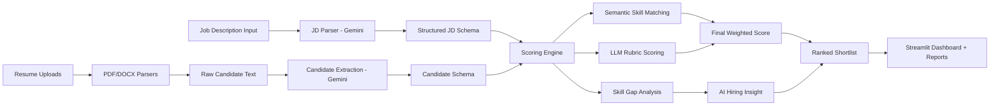

# HireU — AI Resume Analyzer

HireU is a resume analysis and candidate shortlisting system built to help recruiters quickly evaluate candidates using AI.

The platform parses Job Descriptions, analyzes resumes, compares candidate skills against role requirements, and generates ranked hiring recommendations with transparent scoring and skill gap analysis.

Built using FastAPI, Streamlit, LangChain, and Google Gemini.

---

## Why I Built This

Recruiters often spend a lot of time manually screening resumes, especially for internship and entry-level roles. I wanted to build a system that could automate parts of this workflow while still keeping the scoring transparent and explainable.

This project was built as part of an AI Enablement internship task and helped me explore:

* LLM-based structured extraction
* semantic similarity search
* FastAPI backend development
* Streamlit dashboards
* AI-assisted scoring systems

---

## Features

### JD Parsing

Extracts structured role requirements from raw Job Description text using Gemini AI.

### Resume Parsing

Parses:

* PDF resumes
* DOCX resumes
* LinkedIn-style JSON profiles

into a structured `Candidate` schema.

### AI Candidate Scoring

Candidates are evaluated across 5 weighted dimensions:

| Dimension     | Weight |
| ------------- | ------ |
| Skills Match  | 30%    |
| Experience    | 25%    |
| Projects      | 20%    |
| Education     | 15%    |
| Communication | 10%    |

The system generates:

* dimension-level scores
* weighted final score
* recommendation labels
* one-line justifications

---

## Skill Gap Analysis

HireU compares:

* skills extracted from the Job Description
* skills extracted from candidate resumes

and displays:

* matched skills
* missing skills
* skill compatibility percentage

The dashboard also includes:

* visual progress indicators
* recommendation labels
* AI-generated hiring insights

---

## AI Hiring Insight

The system generates a short recruiter-style summary describing:

* candidate strengths
* missing technical areas
* overall fit for the role
* interview recommendation

---

## Human-in-the-Loop Override

Recruiters can manually:

* override candidate scores
* provide reasoning for score changes
* review detailed scoring breakdowns

This keeps the final decision process transparent and controllable.

---

## Project Architecture



---

## Tech Stack

| Layer          | Technology                                 |
| -------------- | ------------------------------------------ |
| Backend        | FastAPI, Uvicorn                           |
| Frontend       | Streamlit                                  |
| AI / LLM       | Google Gemini 2.5 Flash                    |
| AI Framework   | LangChain                                  |
| Embeddings     | sentence-transformers (`all-MiniLM-L6-v2`) |
| Resume Parsing | PyMuPDF, python-docx                       |
| Validation     | Pydantic                                   |
| Reports        | Jinja2, ReportLab                          |

---

## Model Choice

### LLM Used

* Model: `gemini-2.5-flash`
* Provider: Google Generative AI

### Why This Model?

I chose Gemini 2.5 Flash because it provides:

* fast response times
* good structured extraction quality
* reliable scoring outputs
* cost-efficient experimentation during development

The model is used for:

* JD parsing
* candidate extraction
* rubric scoring
* hiring insight generation

---

## Scoring Logic

### Weighted Evaluation

| Component     | Weight |
| ------------- | ------ |
| Skills Match  | 30%    |
| Experience    | 25%    |
| Projects      | 20%    |
| Education     | 15%    |
| Communication | 10%    |

### Recommendation Thresholds

| Score    | Recommendation |
| -------- | -------------- |
| 75+      | Strong Hire    |
| 60–74    | Hire           |
| 45–59    | Needs Review   |
| Below 45 | No-Hire        |

### Skill Match Thresholds

| Match %   | Label       |
| --------- | ----------- |
| 85%+      | Strong Hire |
| 70–84%    | Hire        |
| 50–69%    | Consider    |
| Below 50% | Reject      |

---

## Setup Instructions

Clone repository:

```bash
git clone https://github.com/watdasouvikdoin/HireU-AI-Resume-Analyzer.git
cd HireU-AI-Resume-Analyzer/project
```

Create virtual environment:

```bash
python -m venv venv
source venv/bin/activate
```

Install dependencies:

```bash
pip install -r requirements.txt
```

---

## Configure Environment Variables

Create `.env` file:

```bash
cp .env.example .env
```

Add:

```env
GOOGLE_API_KEY=your_gemini_api_key
API_KEY=your_api_key
```

---

## Running the Backend

```bash
uvicorn app.main:app --reload
```

Backend:

```text
http://127.0.0.1:8000
```

---

## Running the Frontend

```bash
streamlit run streamlit_app.py
```

Frontend:

```text
http://localhost:8501
```

---

## API Endpoints

| Method | Endpoint                     | Description                 |
| ------ | ---------------------------- | --------------------------- |
| GET    | `/api/v1/health`             | Health check                |
| POST   | `/api/v1/parse_jd`           | Parse Job Description       |
| POST   | `/api/v1/upload_resumes`     | Upload resumes              |
| POST   | `/api/v1/analyze_candidates` | Analyze and rank candidates |
| POST   | `/api/v1/skill_gap`          | Skill gap analysis          |
| POST   | `/api/v1/generate_report`    | Export reports              |
| POST   | `/api/v1/override_score`     | Human score override        |

---

## Project Structure

```text
HireU-AI-Resume-Analyzer/
├── project/
│   ├── app/
│   │   ├── api/
│   │   ├── models/
│   │   ├── parsers/
│   │   ├── reporting/
│   │   ├── services/
│   │   └── utils/
│   ├── streamlit_app.py
│   └── requirements.txt
├── LICENSE
└── README.md
```

---

## Security Notes

* API keys are stored using `.env`
* `.env` is excluded using `.gitignore`
* Structured outputs reduce malformed AI responses
* Resume data is processed locally during runtime
* Human override support prevents fully automated decisions

---

## Current Limitations

* LinkedIn integration currently supports JSON input only
* Skill matching depends on resume formatting quality
* LLM scoring may vary slightly between runs
* Large resume batches may increase response time

---

## Future Improvements

* LinkedIn API integration
* Authentication system
* Recruiter dashboards
* Resume analytics visualizations
* Interview question generation
* Multi-role comparison support

---

## Screenshots

Add screenshots for:

* JD Parsing
* Ranked Shortlist
* Skill Gap Analysis
* AI Hiring Insights
* Human Override Dashboard

---

## Author

Developed by Souvik Ghosh
