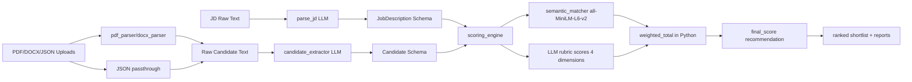

# HR-Resume-LinkedIn-Shortlisting-Agent

**HR Resume & LinkedIn Shortlisting Agent** helps hiring teams process a Job Description (JD), parse candidate profiles from resumes/LinkedIn data, score candidates with semantic + model-based checks, and generate shortlist reports.

Repository structure note: implementation lives in `project/`.

## Project Overview

This system helps HR teams shortlist candidates with transparent scoring:

- Parse JD text into a strict `JobDescription` schema.
- Parse resumes (`.pdf`, `.docx`) and profile JSON into a strict `Candidate` schema.
- Score candidates using:
  - semantic skill matching (`all-MiniLM-L6-v2`) and
  - LLM-based rubric scoring for experience, education, projects, and communication.
- Compute deterministic weighted final score in Python.
- Rank candidates and generate HTML/PDF/JSON reports.
- Support human overrides with reason logging.

## Implementation Notes

### 1) Model Choice

- **Model:** `gemini-2.5-flash`
- **Provider:** Google (via `langchain-google-genai`)
- **Why this model:** fast responses, strong structured extraction/scoring quality for this task, and cost-effective iteration.
- **How it's used:** full JD/resume text is passed to the model, and structured output is enforced with LangChain `with_structured_output(...)`.

### 2) Framework

- **Framework:** LangChain (single orchestration flow in this project; not multi-agent).
- **Version source:** installed through `project/requirements.txt` (`langchain`, `langchain-google-genai`).
- **Architecture usage in this repo:**
  - `project/app/services/jd_parser.py` -> LLM structured JD extraction.
  - `project/app/parsers/candidate_extractor.py` -> LLM structured candidate extraction.
  - `project/app/services/scoring_engine.py` -> LLM structured rubric scores for 4 sections.

### 3) Prompting Strategy

Prompting is embedded in service modules and designed for bounded outputs:

- **JD parsing prompt** instructs extraction from raw JD into `JobDescription`.
- **Candidate extraction prompt** instructs strict extraction into `Candidate`, with defaults for missing fields.
- **Scoring prompt** explicitly asks for `0-10` scores and one-line justifications per dimension.
- **Guardrails in prompt logic:** explicit rules like not penalizing degree by graduation year and constraining communication criteria to resume quality signals.

### 4) System Architecture Diagram



## Setup Instructions

From repository root:

```bash
cd project
python -m venv venv
source venv/bin/activate
pip install -r requirements.txt
cp .env.example .env
```

Set required keys in `project/.env`:

- `GOOGLE_API_KEY=...`
- `API_KEY=...` (for endpoint auth when middleware is enabled)

Run backend API:

```bash
cd project
uvicorn app.main:app --reload
```

Run Streamlit UI (optional):

```bash
cd project
streamlit run streamlit_app.py
```

## How It Works (End-to-End)

1. `POST /api/v1/parse_jd` parses JD to `JobDescription`.
2. `POST /api/v1/upload_resumes` extracts candidate profiles from uploaded files.
3. `POST /api/v1/analyze_candidates` computes:
   - skills score from semantic matching,
   - 4 LLM rubric scores,
   - weighted final score + recommendation.
4. Results are sorted by `final_score` descending.
5. `POST /api/v1/generate_report` exports shortlist as HTML/PDF/JSON.

## Scoring Logic

In `project/app/services/scoring_engine.py`:

- **Skills (30%)**: semantic similarity against JD skills using `all-MiniLM-L6-v2`.
- **Experience (25%), Education (15%), Projects (20%), Communication (10%)**: LLM scores (`0-10`) with structured output.
- Final deterministic math:
  - `weighted_total` out of 10
  - `final_score_100 = weighted_total * 10`
- Recommendation thresholds:
  - `>= 75`: Strong Hire
  - `>= 60`: Hire
  - `>= 45`: Needs Review
  - else: No-Hire


## Tech Stack

- FastAPI, Uvicorn
- Pydantic, pydantic-settings
- LangChain, langchain-google-genai, google-generativeai
- sentence-transformers (`all-MiniLM-L6-v2`)
- PyMuPDF, python-docx
- Jinja2, ReportLab
- Streamlit, requests
