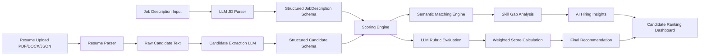

# HireU-AI-Resume-Analyzer

## HireU — AI Resume Intelligence & Candidate Shortlisting Platform

HireU is an AI-powered resume intelligence platform designed to help recruiters and hiring teams streamline candidate screening, resume analysis, and shortlist generation using Large Language Models (LLMs), semantic matching, and explainable scoring pipelines.

The platform parses Job Descriptions (JDs), analyzes candidate resumes and LinkedIn-style profile data, evaluates candidate-job compatibility, identifies skill gaps, and generates transparent hiring recommendations with recruiter-friendly insights.

Repository structure note: implementation lives inside the `project/` directory.

---

# Features

## AI-Powered Resume Analysis

* Parse and structure candidate resumes from:

  * PDF resumes
  * DOCX resumes
  * JSON profile data

## Intelligent JD Parsing

* Extract:

  * required skills
  * preferred skills
  * qualifications
  * experience requirements
  * responsibilities
  * domain relevance

## Semantic Candidate Matching

* Uses embedding similarity (`all-MiniLM-L6-v2`) to compare:

  * candidate skills
  * job requirements
  * semantic relevance

## Explainable AI Scoring

Candidates are scored across multiple hiring dimensions:

| Dimension                  | Weight |
| -------------------------- | ------ |
| Skills Match               | 30%    |
| Experience Relevance       | 25%    |
| Education & Certifications | 15%    |
| Projects & Portfolio       | 20%    |
| Communication Quality      | 10%    |

The platform generates:

* dimension-level scores
* weighted final score
* one-line justifications
* hiring recommendation

---

# New Feature — Skill Gap Analysis

HireU includes an advanced Skill Gap Analysis engine that compares:

* skills extracted from the Job Description
* skills extracted from candidate resumes

The system visually displays:

* Matching Skills
* Missing Skills
* Skill Match Percentage
* AI-generated hiring insights

## AI Hiring Insight Engine

The platform generates recruiter-style insights including:

* candidate strengths
* missing technical skills
* interview readiness
* hiring recommendation
* next-step suggestion

## Recommendation Levels

| Match Score | Recommendation |
| ----------- | -------------- |
| 85%+        | Strong Hire    |
| 70–84%      | Hire           |
| 50–69%      | Consider       |
| Below 50%   | Reject         |

---

# Project Architecture



---

# Tech Stack

## Backend

* FastAPI
* Uvicorn
* Pydantic
* LangChain
* Google Gemini API

## AI / NLP

* Gemini 2.5 Flash
* Sentence Transformers
* all-MiniLM-L6-v2 embeddings

## Resume Processing

* PyMuPDF
* python-docx

## Frontend

* Streamlit

## Reporting & Utilities

* Jinja2
* ReportLab
* Requests

---

# Model Choice

## LLM Used

* Model: `gemini-2.5-flash`
* Provider: Google Generative AI

## Why This Model?

* Fast response latency
* Strong structured extraction capabilities
* Cost-efficient for iterative AI workflows
* Reliable JSON-style structured outputs
* Good balance between reasoning and speed

The model is used for:

* JD parsing
* candidate extraction
* rubric scoring
* AI insight generation

---

# Framework & Orchestration

## Framework

* LangChain

## Architecture Style

HireU follows a modular orchestration pipeline rather than a multi-agent architecture.

The pipeline includes:

* JD parsing service
* Candidate extraction service
* Semantic scoring engine
* Skill gap analysis engine
* AI insight generation layer
* Ranking & reporting system

---

# Prompting Strategy

Prompt engineering is designed to produce:

* deterministic outputs
* structured responses
* recruiter-friendly evaluations

The prompts:

* constrain outputs to structured schemas
* enforce 0–10 scoring ranges
* avoid hallucinated resume information
* prevent inconsistent scoring logic

Guardrails include:

* structured output validation
* bounded rubric logic
* fallback defaults for missing fields
* recommendation threshold controls

---

# Security Mitigations

HireU includes multiple security-focused implementation practices.

## Prompt Injection Protection

* Structured Pydantic schemas
* Controlled prompts
* Output validation

## API Key Protection

* `.env` based secret handling
* `.env` excluded via `.gitignore`
* No hardcoded credentials

## Data Privacy

* Local resume processing
* No persistent resume storage
* Limited sensitive logging

## Hallucination Reduction

* Structured outputs
* Deterministic weighted calculations
* Human-readable justification requirements

## Human-in-the-Loop

* Recruiters can manually review scores
* Override support included

---

# Setup Instructions

Clone repository:

```bash
git clone https://github.com/watdasouvikdoin/HireU-AI-Resume-Analyzer.git
cd HireU-AI-Resume-Analyzer/project
```

Create virtual environment:

```bash
python -m venv venv
source venv/bin/activate
```

Install dependencies:

```bash
pip install -r requirements.txt
```

Configure environment variables:

```bash
cp .env.example .env
```

Add required keys:

```env
GOOGLE_API_KEY=your_key_here
API_KEY=your_api_key_here
```

---

# Running the Backend

```bash
uvicorn app.main:app --reload
```

# Running the Streamlit Frontend

```bash
streamlit run streamlit_app.py
```

---

# End-to-End Workflow

1. Upload Job Description
2. Parse JD into structured schema
3. Upload candidate resumes
4. Extract candidate data
5. Perform semantic matching
6. Generate rubric scores
7. Compute weighted final score
8. Perform Skill Gap Analysis
9. Generate AI hiring insights
10. Rank candidates
11. Generate shortlist reports

---

# Scoring Logic

## Weighted Evaluation System

| Component     | Weight |
| ------------- | ------ |
| Skills Match  | 30%    |
| Experience    | 25%    |
| Education     | 15%    |
| Projects      | 20%    |
| Communication | 10%    |

Final score is computed deterministically in Python for consistency and transparency.

---

# Future Improvements

* LinkedIn API integration
* ATS integration
* Multi-agent recruiter workflows
* Interview question generation
* Resume ranking analytics dashboard
* Authentication & recruiter accounts
* Cloud deployment pipeline
* Candidate trend visualization

---

# Screenshots

Add screenshots of:

* JD parsing
* candidate analysis dashboard
* skill gap analysis
* AI hiring insights
* ranking table
* recommendation cards

---

# Author

Developed by Souvik Ghosh

HireU — Smarter AI hiring decisions for modern recruiters.
