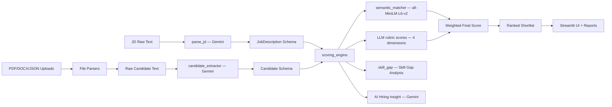

# HireU — AI Resume Intelligence Platform

**HireU** is an AI-powered resume analysis and candidate shortlisting platform. Upload a Job Description and a batch of candidate resumes to get an AI-scored ranked shortlist — complete with Skill Gap Analysis, AI Hiring Insights, and Human-in-the-Loop overrides.

> Built with Google Gemini, LangChain, FastAPI, and Streamlit.

---

## ✨ Features

- **📄 JD Parsing** — Extracts structured role requirements from raw Job Description text using Gemini AI.
- **👤 Resume Parsing** — Parses PDF, DOCX, and LinkedIn JSON profiles into a strict `Candidate` schema.
- **📊 AI Scoring Engine** — Scores each candidate across 5 weighted dimensions:
  - Skills (30%), Experience (25%), Projects (20%), Education (15%), Communication (10%)
- **🔬 Skill Gap Analysis** — Compares JD skills vs. candidate skills semantically and shows:
  - ✅ Matched skills (green chips)
  - ❌ Missing skills (red chips)
  - 📈 Skill compatibility percentage with a visual progress bar
- **🤖 AI Hiring Insight** — Gemini-generated recruiter-style summary covering candidate strengths, skill gaps, and a final interview recommendation.
- **⚖️ Human-in-the-Loop Override** — Manually adjust any candidate's score with a reason log.
- **📁 Report Export** — Generate HTML, PDF, and JSON shortlist reports.

---

## 🏗️ Architecture



---

## 🚀 Quick Start

### 1. Clone & Install

```bash
git clone https://github.com/watdasouvikdoin/HireU-AI-Resume-Analyzer.git
cd HireU-AI-Resume-Analyzer/project
pip install -r requirements.txt
```

### 2. Configure Environment

```bash
cp .env.example .env
```

Edit `project/.env` and set:
```
GOOGLE_API_KEY=your_gemini_api_key_here
API_KEY=your_secure_api_key_for_endpoints
```

Get your free Gemini API key at: https://aistudio.google.com/app/apikey

### 3. Start the Backend

```bash
cd project
uvicorn app.main:app --reload
```

Backend runs at: `http://127.0.0.1:8000`

### 4. Start the Frontend

```bash
cd project
streamlit run streamlit_app.py
```

Frontend runs at: `http://localhost:8501`

---

## 📡 API Endpoints

| Method | Endpoint | Description |
|--------|----------|-------------|
| `GET` | `/api/v1/health` | Health check |
| `POST` | `/api/v1/parse_jd` | Parse raw JD text into structured schema |
| `POST` | `/api/v1/upload_resumes` | Upload and extract candidate profiles |
| `POST` | `/api/v1/analyze_candidates` | Score, rank, and generate skill gap analysis |
| `POST` | `/api/v1/skill_gap` | Standalone skill gap for a JD + candidate pair |
| `POST` | `/api/v1/generate_report` | Export shortlist as HTML / PDF / JSON |
| `POST` | `/api/v1/override_score` | Apply human override to a candidate's score |

---

## 📈 Scoring Logic

**Weighted dimensions** (`project/app/services/scoring_engine.py`):

| Dimension | Weight | Method |
|-----------|--------|--------|
| Skills | 30% | Semantic similarity (`all-MiniLM-L6-v2`) |
| Experience | 25% | Gemini LLM rubric (0–10) |
| Projects | 20% | Gemini LLM rubric (0–10) |
| Education | 15% | Gemini LLM rubric (0–10) |
| Communication | 10% | Gemini LLM rubric (0–10) |

**Recommendation thresholds:**

| Score | Label |
|-------|-------|
| ≥ 75 | ✅ Strong Hire |
| ≥ 60 | 🟢 Hire |
| ≥ 45 | 🟡 Needs Review |
| < 45 | 🔴 No-Hire |

**Skill Gap thresholds:**

| Skill Match % | Label |
|---------------|-------|
| ≥ 85% | 💚 Strong Hire |
| ≥ 70% | 🔵 Hire |
| ≥ 50% | 🟡 Consider |
| < 50% | 🔴 Reject |

---

## 🛠️ Tech Stack

| Layer | Technology |
|-------|------------|
| AI / LLM | Google Gemini 2.5 Flash via `langchain-google-genai` |
| Semantic Matching | `sentence-transformers` (`all-MiniLM-L6-v2`) |
| Backend | FastAPI, Uvicorn |
| Frontend | Streamlit |
| Data Validation | Pydantic, pydantic-settings |
| Resume Parsing | PyMuPDF, python-docx |
| Report Generation | Jinja2, ReportLab |

---

## 📁 Project Structure

```
HireU-AI-Resume-Analyzer/
├── project/
│   ├── app/
│   │   ├── api/endpoints.py          # All API routes
│   │   ├── models/                   # Pydantic schemas (JD, Candidate)
│   │   ├── parsers/                  # PDF, DOCX, LinkedIn parsers
│   │   ├── services/
│   │   │   ├── jd_parser.py          # JD extraction with Gemini
│   │   │   ├── scoring_engine.py     # Weighted scoring logic
│   │   │   ├── semantic_matcher.py   # Skill similarity with embeddings
│   │   │   └── skill_gap.py          # Skill Gap Analysis + AI Insight
│   │   ├── reporting/                # HTML, PDF report generators
│   │   └── utils/config.py           # Settings & env vars
│   ├── streamlit_app.py              # Streamlit frontend
│   └── requirements.txt
├── LICENSE
└── README.md
```

---

## 🔐 Security

- API key authentication via `X-API-Key` header (middleware in `app/security/`).
- `.env` is gitignored — never committed.
- See `project/SECURITY.md` for full security notes.

---

## 📄 License

MIT License © 2026 Souvik Ghosh
